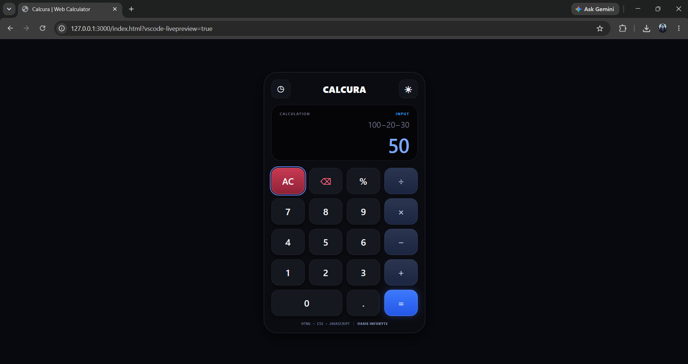
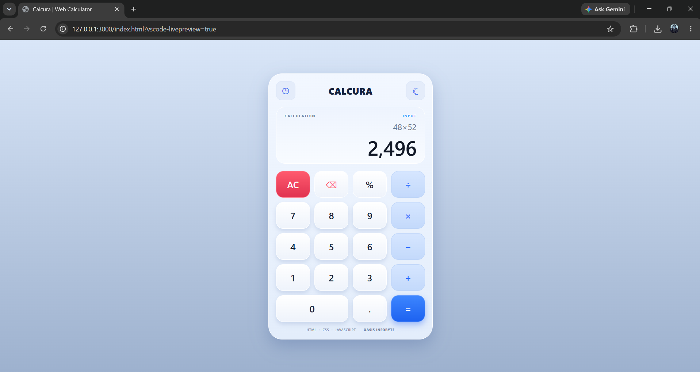
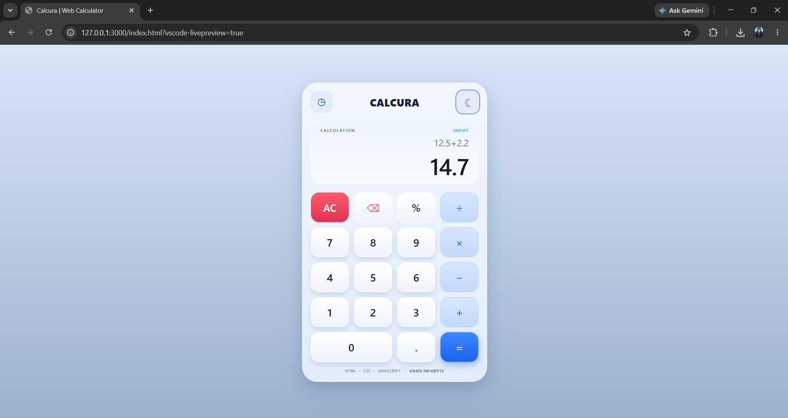
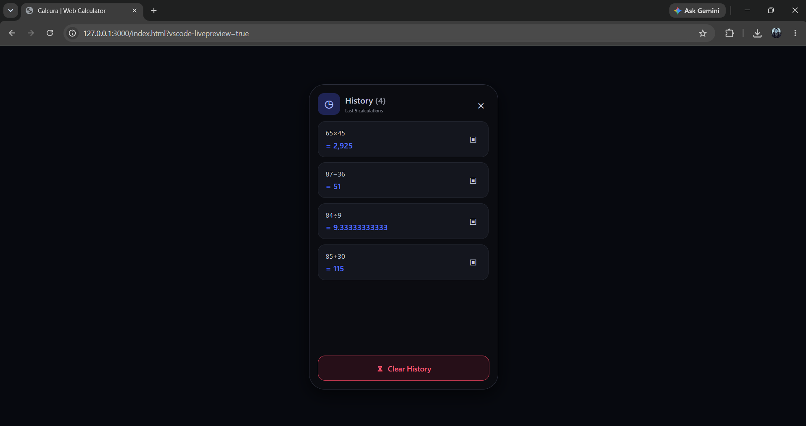
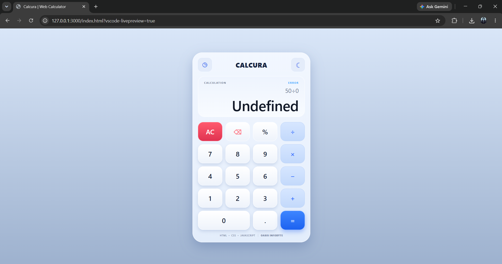

# 🧮 CALCURA

### Modern Web Calculator

A clean, responsive and interactive web calculator built using **HTML5, CSS3 and Vanilla JavaScript** as part of the **Oasis Infobyte Web Development & Designing Internship**.

---

## 📌 Overview

**CALCURA** is a modern web-based calculator designed with a professional and minimal interface.

It supports basic arithmetic operations, calculation history, theme switching and error handling while maintaining a responsive layout across different screen sizes.

The project focuses on:

- Clean user interface
- Responsive design
- Simple user experience
- JavaScript-based calculation logic
- Proper input validation
- Interactive calculation history

---

## ✨ Features

### 🧮 Calculator Operations

- Addition `+`
- Subtraction `−`
- Multiplication `×`
- Division `÷`
- Decimal calculations
- Operator chaining
- Real-time calculation display
- Equals `=` functionality

### ⚙️ Controls

- **AC** — Clear the current calculation
- **⌫** — Delete the last entered character
- **=** — Calculate the result

### 🛡️ Error Handling

- Division-by-zero protection
- Invalid calculation handling
- Clear error status display
- Prevents invalid calculator states

### 🕘 Calculation History

- Stores previous calculations
- Displays calculation history
- History panel
- Clear history option

### 🎨 Themes

CALCURA includes two visual themes:

#### 🌑 Minimal Dark
A professional dark interface designed for comfortable usage.

#### ☁️ Light Modern
A clean light interface with a soft modern appearance.

Users can switch between the available themes directly from the calculator interface.

---

## 🖥️ Interface Preview

### Minimal Dark Mode



---

### Light Modern Mode



---

### Calculator Operations



---

### Calculation History



---

### Error Handling



---

## 🛠️ Technology Stack

| Technology | Purpose |
|------------|---------|
| HTML5 | Structure and semantic markup |
| CSS3 | Styling, layout and responsive design |
| JavaScript | Calculator logic and interactions |
| CSS Grid | Calculator button layout |
| Local Browser Storage | Calculation history |

---

## 📂 Project Structure

```text
WebDev-L2-Calculator/
│
├── index.html
├── style.css
├── script.js
├── README.md
│
└── screenshots/
    ├── calculator_darkmode.png
    ├── calculator_lightmode.png
    ├── calculator_operations.png
    ├── calculator_history.png
    └── calculator_error.png